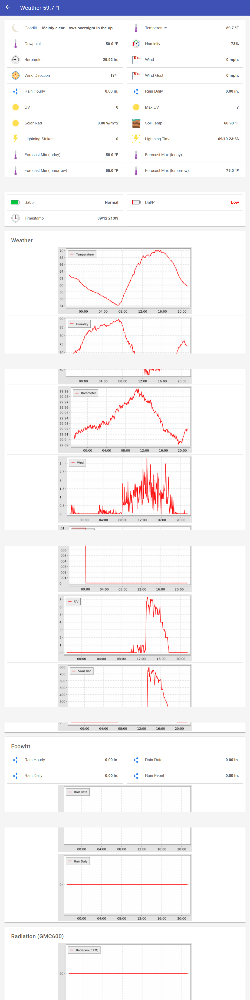
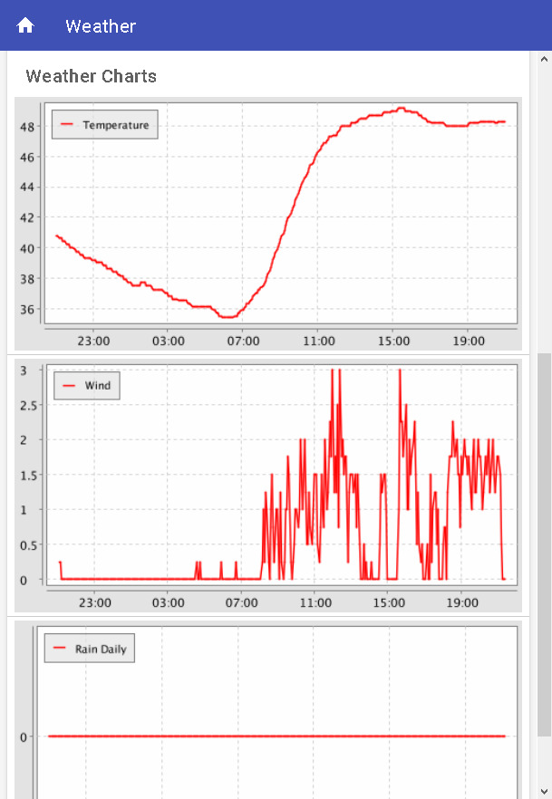

## AcuRite Weather Scripts
These scripts intercept and log the sensor data from the acurite weatherbridge, providing access to all metrics sent to acurite and weatherunderground, and optionally restricting the information/status sent back to the bridge, such as to prevent auto-update.

### Features:
The following options may be turned on/off through variables in the script.

- if an external temperature and humidity sensor is present then that data is substituted for the 5 in 1 sensors values. 
- add soil temperature to weather underground if sensor is available
- recalculate/smooth the "rainin" parameter sent to wunderground based on the 15minute accumulated rain rather than the sensor metric which resets every hour.
- store all sensor data in a sqlite database
- publish sensor data to MQTT (for use in openhab, etc....)
- log all low-level request data to/from the bridge
- freeze updates on the bridge (so this script will continue to work)

See the "upateweatherstation.php" script for further parameters.

### Requirements:

- a webserver
- dnsmasq or equiv 

### Installation:

- edit the variables in the begining of the weathertation.php script as desired
- place all scripts inside a directory "weatherstation" on your web server directly below $HTDOCS. 
- make the ip address of the weatherbridge static by using dhcp reservations
- fake entries (dnsmasq, etc...) for hubapi.myacurite.com and rtupdate.wunderground.com so that your webserver receives the weatherbridge GET instead of the real DNS hosts.

One easy way to add dnsmasq entries is with a router that supports it  (dd-wrt, tomato, merlin, etc...), for example (assuming 192.168.1.250 is the acurite bridge) add the following to /tmp/etc/hosts and /jffs/config/hosts.add on the router:	

	192.168.1.250 mylocalwebserver hubapi.myacurite.com rtupdate.wunderground.com

### Testing:

If all is working, and logging is enabled,  you should see the following files under $HTDOCS/weatherstation:

**logfile.txt** logging information

**weather.dat** key-values containing the most recent metrics and values

**weather.db3** database, if you have enabled the database (use something like *sqlite3 weather.db3*)

### Notes on Apache Configuration:

The configuration for the weatherstation directory should include something like the following (based on modrewrite) because acurite does not use a script extension on their URI. 

	RewriteCond %{REQUEST_FILENAME} !-d
	RewriteCond %{REQUEST_FILENAME}\.php -f
	RewriteRule ^(.*)$ $1.php

The weatherbridge uses http so you need to have Apache listening on port 80. If running with SSL remember to disable it for the weatherstation script:

	RewriteRule "^/weatherstation" - [L]
	# other rules that redirect traffic to 443

### Debugging:
Normal messages in the log  (LOGRESPONSE=true) look like:

	[2017/03/17 00:19:01] acurite_from: {"localtime":"00:00:00","checkversion":"224"}
	[2017/03/17 00:19:01] acurite_brdg: {"localtime":"00:00:00","checkversion":"224"}
	[2017/03/17 00:19:55] wunderground: success

There are two acurite GET requests from the bridge for every weatherunderground GET. The "localtime" parameter does not update in realtime, and is sometimes absent. All acurite responses are json.

Wunderground will return the string "success" mostly, and occasionally return garbage or timeout. These errors should be expected.

	[2017/03/15 04:50:33] Curl error: rtupdate.wunderground.com:52.25.21.79: Empty reply from server

### Openhab Samples:
The directory openhab contains a sample configuration using the MQTT bindings.

